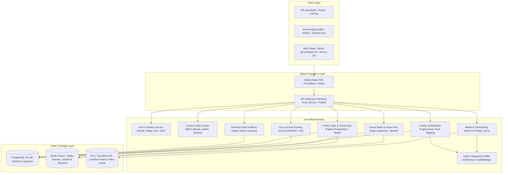

# Groundwave (`groundwave.fm`)
## System Architecture Specification & Data Model

---

## 1. High-Level Architecture Diagram



---

## 2. Core Relational Data Models (PostgreSQL DDL)

```sql
-- Enable necessary database extensions
CREATE EXTENSION IF NOT EXISTS "uuid-ossp";
CREATE EXTENSION IF NOT EXISTS postgis;
CREATE EXTENSION IF NOT EXISTS vector;

-- =========================================================
-- 1. INDIVIDUAL HUMAN USERS (Personal Identity & Auth)
-- Every user is fundamentally a Listener/Fan with personal auth.
-- =========================================================
CREATE TABLE users (
    id UUID PRIMARY KEY DEFAULT uuid_generate_v4(),
    email VARCHAR(255) UNIQUE NOT NULL,
    username VARCHAR(50) UNIQUE NOT NULL, -- personal handle: e.g. @maya_guitar
    display_name VARCHAR(100) NOT NULL,
    bio TEXT,
    avatar_url TEXT,
    banner_url TEXT,
    h3_index_res8 VARCHAR(15), -- Obfuscated location (~1km resolution)
    city_name VARCHAR(100),
    country_code CHAR(2),
    is_platform_admin BOOLEAN DEFAULT FALSE,
    created_at TIMESTAMPTZ DEFAULT NOW(),
    updated_at TIMESTAMPTZ DEFAULT NOW()
);

-- =========================================================
-- 2. CREATOR COLLECTIVES & ENTITIES (Bands, Solo Acts, Labels, Venues, Curators)
-- Multi-user organizational entities that publish music and manage hubs.
-- =========================================================
CREATE TABLE creator_entities (
    id UUID PRIMARY KEY DEFAULT uuid_generate_v4(),
    slug VARCHAR(50) UNIQUE NOT NULL, -- public entity handle: e.g. @static_veins, @midwest_pressings
    name VARCHAR(100) NOT NULL,
    entity_type VARCHAR(20) NOT NULL CHECK (entity_type IN ('solo_artist', 'band', 'label', 'curator', 'venue')),
    bio TEXT,
    avatar_url TEXT,
    banner_url TEXT,
    city_name VARCHAR(100),
    country_code CHAR(2),
    h3_index_res8 VARCHAR(15),
    stripe_account_id VARCHAR(100) UNIQUE,
    payouts_enabled BOOLEAN DEFAULT FALSE,
    community_guidelines TEXT,
    allow_fan_posts BOOLEAN DEFAULT TRUE,
    require_mod_approval BOOLEAN DEFAULT FALSE,
    verification_status VARCHAR(20) NOT NULL DEFAULT 'unverified' CHECK (verification_status IN ('unverified', 'pending', 'verified', 'suspended')),
    created_at TIMESTAMPTZ DEFAULT NOW(),
    updated_at TIMESTAMPTZ DEFAULT NOW()
);

-- =========================================================
-- 3. ENTITY TEAM MEMBERSHIPS & PERMISSIONS (Multi-User Control)
-- Links human users to creator entities with granular RBAC permissions.
-- =========================================================
CREATE TABLE entity_memberships (
    id UUID PRIMARY KEY DEFAULT uuid_generate_v4(),
    entity_id UUID NOT NULL REFERENCES creator_entities(id) ON DELETE CASCADE,
    user_id UUID NOT NULL REFERENCES users(id) ON DELETE CASCADE,
    role VARCHAR(20) NOT NULL CHECK (role IN ('owner', 'admin', 'member', 'moderator', 'finance_manager')),
    member_title VARCHAR(50), -- e.g. "Lead Vocals", "Label Founder", "Street Team Captain"
    royalty_split_pct DECIMAL(5,2) DEFAULT 0.00, -- Default internal band split share
    created_at TIMESTAMPTZ DEFAULT NOW(),
    UNIQUE(entity_id, user_id)
);

-- =========================================================
-- 4. LABEL ROSTER RELATIONSHIPS (B2B Multi-Entity Links)
-- Links indie record labels to signed bands/artists with contractual terms.
-- =========================================================
CREATE TABLE label_roster_memberships (
    id UUID PRIMARY KEY DEFAULT uuid_generate_v4(),
    label_entity_id UUID NOT NULL REFERENCES creator_entities(id) ON DELETE CASCADE,
    artist_entity_id UUID NOT NULL REFERENCES creator_entities(id) ON DELETE CASCADE,
    contract_start_date DATE NOT NULL DEFAULT CURRENT_DATE,
    contract_end_date DATE,
    default_royalty_split_pct DECIMAL(5,2) DEFAULT 50.00,
    can_manage_releases BOOLEAN DEFAULT TRUE,
    created_at TIMESTAMPTZ DEFAULT NOW(),
    UNIQUE(label_entity_id, artist_entity_id)
);

-- =========================================================
-- 5. RELEASES & TRACKS (Owned by Creator Entities)
-- =========================================================
CREATE TABLE releases (
    id UUID PRIMARY KEY DEFAULT uuid_generate_v4(),
    creator_entity_id UUID NOT NULL REFERENCES creator_entities(id) ON DELETE CASCADE,
    label_entity_id UUID REFERENCES creator_entities(id) ON DELETE SET NULL,
    title VARCHAR(255) NOT NULL,
    release_type VARCHAR(20) NOT NULL CHECK (release_type IN ('single', 'ep', 'album', 'label_compilation', 'stem_pack', 'live_bootleg')),
    cover_art_url TEXT NOT NULL,
    release_date DATE NOT NULL DEFAULT CURRENT_DATE,
    is_exclusive_to_tier UUID,
    created_at TIMESTAMPTZ DEFAULT NOW()
);

CREATE TABLE tracks (
    id UUID PRIMARY KEY DEFAULT uuid_generate_v4(),
    release_id UUID NOT NULL REFERENCES releases(id) ON DELETE CASCADE,
    creator_entity_id UUID NOT NULL REFERENCES creator_entities(id) ON DELETE CASCADE,
    title VARCHAR(255) NOT NULL,
    track_number INT DEFAULT 1,
    duration_seconds INT NOT NULL,
    hls_master_manifest_url TEXT NOT NULL,
    lossless_flac_url TEXT,
    stems_zip_url TEXT,
    isrc_code VARCHAR(50),
    audio_fingerprint_id VARCHAR(255),
    play_count BIGINT DEFAULT 0,
    acoustic_embedding vector(128),
    scene_co_occurrence_embedding vector(128),
    created_at TIMESTAMPTZ DEFAULT NOW()
);

-- =========================================================
-- 6. COMMUNITY HUBS & POSTS
-- Hubs belong to Creator Entities; individual Users author posts.
-- =========================================================
CREATE TABLE community_posts (
    id UUID PRIMARY KEY DEFAULT uuid_generate_v4(),
    hub_entity_id UUID NOT NULL REFERENCES creator_entities(id) ON DELETE CASCADE,
    author_user_id UUID NOT NULL REFERENCES users(id) ON DELETE CASCADE,
    post_type VARCHAR(20) NOT NULL CHECK (post_type IN ('creator_broadcast', 'fan_post', 'exclusive_drop', 'event_announcement', 'curator_review')),
    visibility VARCHAR(20) NOT NULL CHECK (visibility IN ('public', 'subscribers_only', 'street_team')),
    content TEXT NOT NULL,
    media_urls TEXT[] DEFAULT '{}',
    is_pinned BOOLEAN DEFAULT FALSE,
    is_approved BOOLEAN DEFAULT TRUE,
    created_at TIMESTAMPTZ DEFAULT NOW()
);

-- =========================================================
-- 7. SUBSCRIPTION TIERS & STOREFRONT
-- =========================================================
CREATE TABLE subscription_tiers (
    id UUID PRIMARY KEY DEFAULT uuid_generate_v4(),
    creator_entity_id UUID NOT NULL REFERENCES creator_entities(id) ON DELETE CASCADE,
    name VARCHAR(100) NOT NULL,
    tier_type VARCHAR(30) NOT NULL DEFAULT 'backstage' CHECK (tier_type IN ('backstage', 'vinyl_club', 'curator_patron', 'street_team_vip')),
    price_monthly_cents INT NOT NULL,
    description TEXT,
    perks JSONB NOT NULL DEFAULT '[]',
    stripe_price_id VARCHAR(100) UNIQUE,
    is_active BOOLEAN DEFAULT TRUE,
    created_at TIMESTAMPTZ DEFAULT NOW()
);

CREATE TABLE products (
    id UUID PRIMARY KEY DEFAULT uuid_generate_v4(),
    seller_entity_id UUID NOT NULL REFERENCES creator_entities(id) ON DELETE CASCADE,
    title VARCHAR(255) NOT NULL,
    product_type VARCHAR(30) NOT NULL CHECK (product_type IN ('vinyl', 'cd', 'cassette', 'apparel', 'ticket', 'digital_download', 'box_set')),
    price_cents INT NOT NULL,
    inventory_count INT DEFAULT 0,
    variants JSONB DEFAULT '[]',
    is_active BOOLEAN DEFAULT TRUE,
    created_at TIMESTAMPTZ DEFAULT NOW()
);
```
