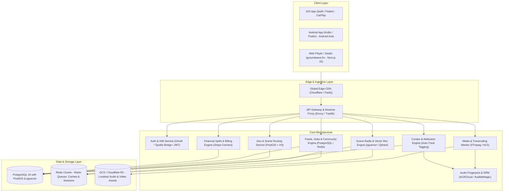

# Groundwave (`groundwave.fm`)
## System Architecture Specification & Data Model

---

## 1. High-Level Architecture Diagram



---

## 2. Core Relational Data Models (PostgreSQL DDL)

```sql
-- Enable vector extension for Scene Radio acoustic & collaborative embeddings
CREATE EXTENSION IF NOT EXISTS vector;
CREATE EXTENSION IF NOT EXISTS postgis;

-- Core User Account (Artists, Labels, Curators, Listeners, Venues)
CREATE TABLE users (
    id UUID PRIMARY KEY DEFAULT gen_random_uuid(),
    username VARCHAR(50) UNIQUE NOT NULL,
    email VARCHAR(255) UNIQUE NOT NULL,
    role VARCHAR(20) NOT NULL CHECK (role IN ('listener', 'artist', 'label', 'curator', 'venue', 'admin')),
    display_name VARCHAR(100) NOT NULL,
    bio TEXT,
    avatar_url TEXT,
    banner_url TEXT,
    h3_index_res8 VARCHAR(15), -- Obfuscated location (~460m to 1km resolution)
    city_name VARCHAR(100),
    country_code CHAR(2),
    created_at TIMESTAMPTZ DEFAULT NOW(),
    updated_at TIMESTAMPTZ DEFAULT NOW()
);

-- Artist Profile & Settings
CREATE TABLE artist_profiles (
    artist_id UUID PRIMARY KEY REFERENCES users(id) ON DELETE CASCADE,
    stripe_account_id VARCHAR(100) UNIQUE,
    payouts_enabled BOOLEAN DEFAULT FALSE,
    spotify_url TEXT,
    bandcamp_url TEXT,
    instagram_handle VARCHAR(50),
    community_guidelines TEXT,
    allow_fan_posts BOOLEAN DEFAULT TRUE,
    require_mod_approval BOOLEAN DEFAULT FALSE,
    created_at TIMESTAMPTZ DEFAULT NOW()
);

-- Independent Record Label Profile & Roster
CREATE TABLE label_profiles (
    label_id UUID PRIMARY KEY REFERENCES users(id) ON DELETE CASCADE,
    stripe_account_id VARCHAR(100) UNIQUE,
    founded_year INT,
    headquarters_city VARCHAR(100),
    distributor_info TEXT,
    has_vinyl_club BOOLEAN DEFAULT FALSE,
    created_at TIMESTAMPTZ DEFAULT NOW()
);

CREATE TABLE label_roster_memberships (
    id UUID PRIMARY KEY DEFAULT gen_random_uuid(),
    label_id UUID NOT NULL REFERENCES users(id) ON DELETE CASCADE,
    artist_id UUID NOT NULL REFERENCES users(id) ON DELETE CASCADE,
    contract_start_date DATE NOT NULL,
    contract_end_date DATE,
    default_royalty_split_pct DECIMAL(5,2) DEFAULT 50.00,
    can_manage_releases BOOLEAN DEFAULT TRUE,
    created_at TIMESTAMPTZ DEFAULT NOW(),
    UNIQUE(label_id, artist_id)
);

-- Verified Curator Profile
CREATE TABLE curator_profiles (
    curator_id UUID PRIMARY KEY REFERENCES users(id) ON DELETE CASCADE,
    verification_status VARCHAR(20) NOT NULL DEFAULT 'pending' CHECK (verification_status IN ('pending', 'verified', 'rejected', 'suspended')),
    reputation_score INT DEFAULT 0,
    curator_type VARCHAR(30) NOT NULL CHECK (curator_type IN ('tastemaker', 'dj', 'journalist', 'college_radio', 'collective')),
    show_name VARCHAR(150),
    stripe_account_id VARCHAR(100) UNIQUE,
    approved_at TIMESTAMPTZ,
    created_at TIMESTAMPTZ DEFAULT NOW()
);

-- Audio Releases (Singles, EPs, Albums, Compilations)
CREATE TABLE releases (
    id UUID PRIMARY KEY DEFAULT gen_random_uuid(),
    primary_artist_id UUID NOT NULL REFERENCES users(id) ON DELETE CASCADE,
    label_id UUID REFERENCES users(id) ON DELETE SET NULL,
    title VARCHAR(255) NOT NULL,
    release_type VARCHAR(20) NOT NULL CHECK (release_type IN ('single', 'ep', 'album', 'label_compilation', 'stem_pack', 'live_bootleg')),
    cover_art_url TEXT NOT NULL,
    release_date DATE NOT NULL,
    is_exclusive_to_tier UUID,
    created_at TIMESTAMPTZ DEFAULT NOW()
);

-- Tracks & Streaming Metadata with Vector Embeddings for Scene Radio
CREATE TABLE tracks (
    id UUID PRIMARY KEY DEFAULT gen_random_uuid(),
    release_id UUID NOT NULL REFERENCES releases(id) ON DELETE CASCADE,
    artist_id UUID NOT NULL REFERENCES users(id) ON DELETE CASCADE,
    title VARCHAR(255) NOT NULL,
    track_number INT DEFAULT 1,
    duration_seconds INT NOT NULL,
    hls_master_manifest_url TEXT NOT NULL,
    lossless_flac_url TEXT,
    stems_zip_url TEXT,
    isrc_code VARCHAR(50),
    audio_fingerprint_id VARCHAR(255),
    play_count BIGINT DEFAULT 0,
    acoustic_embedding vector(128), -- Latent acoustic audio features
    scene_co_occurrence_embedding vector(128), -- Playlist & local scene co-occurrence vector
    created_at TIMESTAMPTZ DEFAULT NOW()
);

-- Curator Original Content (Shows, Podcasts, Annotated Playlists)
CREATE TABLE curator_content (
    id UUID PRIMARY KEY DEFAULT gen_random_uuid(),
    curator_id UUID NOT NULL REFERENCES users(id) ON DELETE CASCADE,
    title VARCHAR(255) NOT NULL,
    content_type VARCHAR(30) NOT NULL CHECK (content_type IN ('podcast_episode', 'radio_show', 'video_essay', 'curated_playlist')),
    description TEXT,
    media_hls_url TEXT,
    thumbnail_url TEXT,
    duration_seconds INT,
    is_subscriber_only BOOLEAN DEFAULT FALSE,
    view_count BIGINT DEFAULT 0,
    created_at TIMESTAMPTZ DEFAULT NOW()
);

-- Track Attribution & Royalties inside Curator Content
CREATE TABLE content_track_attributions (
    id UUID PRIMARY KEY DEFAULT gen_random_uuid(),
    content_id UUID NOT NULL REFERENCES curator_content(id) ON DELETE CASCADE,
    track_id UUID NOT NULL REFERENCES tracks(id) ON DELETE CASCADE,
    start_second INT NOT NULL,
    end_second INT NOT NULL,
    attribution_type VARCHAR(20) DEFAULT 'featured_spin' CHECK (attribution_type IN ('featured_spin', 'background_music', 'sample_analysis', 'playlist_entry')),
    created_at TIMESTAMPTZ DEFAULT NOW()
);

-- Community Posts (Artist & Label Hubs)
CREATE TABLE community_posts (
    id UUID PRIMARY KEY DEFAULT gen_random_uuid(),
    hub_id UUID NOT NULL REFERENCES users(id) ON DELETE CASCADE,
    author_id UUID NOT NULL REFERENCES users(id) ON DELETE CASCADE,
    post_type VARCHAR(20) NOT NULL CHECK (post_type IN ('creator_broadcast', 'fan_post', 'exclusive_drop', 'event_announcement', 'curator_review')),
    visibility VARCHAR(20) NOT NULL CHECK (visibility IN ('public', 'subscribers_only', 'street_team')),
    content TEXT NOT NULL,
    media_urls TEXT[] DEFAULT '{}',
    is_pinned BOOLEAN DEFAULT FALSE,
    is_approved BOOLEAN DEFAULT TRUE,
    created_at TIMESTAMPTZ DEFAULT NOW()
);

-- Subscription Tiers ("Backstage Clubs" / "Label Vinyl Clubs")
CREATE TABLE subscription_tiers (
    id UUID PRIMARY KEY DEFAULT gen_random_uuid(),
    creator_id UUID NOT NULL REFERENCES users(id) ON DELETE CASCADE,
    name VARCHAR(100) NOT NULL,
    tier_type VARCHAR(30) NOT NULL DEFAULT 'backstage' CHECK (tier_type IN ('backstage', 'vinyl_club', 'curator_patron', 'street_team_vip')),
    price_monthly_cents INT NOT NULL,
    description TEXT,
    perks JSONB NOT NULL DEFAULT '[]',
    stripe_price_id VARCHAR(100) UNIQUE,
    is_active BOOLEAN DEFAULT TRUE,
    created_at TIMESTAMPTZ DEFAULT NOW()
);

-- Storefront Products (Artist & Label Merch, Vinyl, Digital)
CREATE TABLE products (
    id UUID PRIMARY KEY DEFAULT gen_random_uuid(),
    seller_id UUID NOT NULL REFERENCES users(id) ON DELETE CASCADE,
    title VARCHAR(255) NOT NULL,
    product_type VARCHAR(30) NOT NULL CHECK (product_type IN ('vinyl', 'cd', 'cassette', 'apparel', 'ticket', 'digital_download', 'box_set')),
    price_cents INT NOT NULL,
    inventory_count INT DEFAULT 0,
    variants JSONB DEFAULT '[]',
    is_active BOOLEAN DEFAULT TRUE,
    created_at TIMESTAMPTZ DEFAULT NOW()
);
```

---

## 3. Scene Radio Algorithmic Recommendation Mechanics

```
  [ User Selects Artist / Scene Seed (e.g. Local Chicago Indie Band) ]
                                   |
                                   v
             [ Retrieve Seed Embeddings + Artist Geo-Coordinates ]
                                   |
      +----------------------------+----------------------------+
      |                                                         |
      v                                                         v
 [ Spatial Candidate Filtering ]                     [ Vector Cosine Scoring ]
 (PostGIS / H3 kRing within                           (pgvector comparison of
  metro area / 50-250mi radius)                        acoustic & scene embeddings)
      |                                                         |
      +----------------------------+----------------------------+
                                   |
                                   v
                     [ Hybrid Score Calculation ]
        Score = (0.45 * VectorSimilarity) + (0.35 * GeoProximityScore)
                + (0.20 * CuratorEndorsementWeight)
                                   |
                                   v
             [ Generate Seamless Non-Stop Stream Queue ]
         (Cached in Redis; dynamic lookahead chunk loading)
```

---

## 4. Multi-Party Automated Revenue Split Flow

```
                      [ Fan Purchase / Subscription / Tip ]
                                      |
                                      v
                       [ Stripe Connect Payment Intent ]
                                      |
         +----------------------------+----------------------------+
         |                                                         |
         v                                                         v
[ Direct Store / Subscription ]                           [ Curator Content Revenue ]
         |                                                         |
    8% Platform Fee                                           10% Platform Fee
         |                                                         |
  92% Remainder to Creator                                  90% Net Distribution
         |                                                         |
         +--> If Artist Direct: 100% to Artist                     +--> 60% to Curator
         +--> If Label Deal: e.g. 50% Artist / 50% Label           +--> 40% Pro-Rata to Featured
                                                                        Tracks (Sound Recording Split)
```
