# Groundwave (`groundwave.fm`)
## Master Plan & Founding Blueprint: The Local-First Music & Creator Economy Platform

---

## 1. Executive Summary & Core Thesis

### 1.1 The Core Problem: The Modern Music Platform Trilemma
The current digital music ecosystem forces independent and mid-tier artists, indie labels, tastemakers, and everyday listeners to navigate three fractured paradigms, none of which provide a sustainable career foundation on their own:

```
                  [ Discovery & Scale ]
                  Traditional DSPs (Spotify, Apple)
                         /              \
                        /                \
                       /   THE TRILEMMA   \
                      /                    \
  [ Direct Monetization ] --------------- [ Engagement & Cultural Identity ]
  Pay-to-Own / Patronage                  General Social (TikTok, IG, Shorts)
  (Bandcamp, Patreon)
```

1. **Traditional DSPs (Spotify, Apple Music, YouTube Music)**:
   * **Strength**: High centralized discovery, background listening convenience, algorithmic playlists.
   * **Failure Mode**: Pro-rata streaming payout model pays ~$0.003–$0.005 per stream, heavily favoring the top 0.1% catalog holders. Algorithmic radios are homogenized, repeatedly recycling the same major-label catalog while leaving listeners detached from local music culture.

2. **Pay-to-Own & Direct Support (Bandcamp, Patreon)**:
   * **Strength**: Direct-to-creator financial model with high payout margins (80–85%+ to artist) and deep fan patronage.
   * **Failure Mode**: Zero organic discovery loop. Bandcamp acts as a digital cash register rather than a daily habit app. Lacks lean-back "radio" listening modes for casual listeners.

3. **General Social Platforms (TikTok, Instagram, YouTube Shorts, X)**:
   * **Strength**: Top-of-funnel virality and bite-sized audio propagation.
   * **Failure Mode**: Content is completely flattened—music competes with dance memes, politics, and lifestyle reels. Platform algorithms actively penalize outbound links (punishing attempts to link out to Spotify, Bandcamp, or ticket stores). Communities are fragmented across external Discords, subreddits, and mailing lists.

### 1.2 The Groundwave Thesis
**Groundwave (`groundwave.fm`) is a local-first, full-stack music platform that unifies high-fidelity music streaming, algorithmic Scene Radios, native artist & indie label storefronts, tiered fan memberships, verified tastemaker curation, and creator-governed micro-communities—anchored by geographic scene discovery.**

The name originates from **ground wave propagation**—the physical mechanism by which radio frequencies travel along the surface of the earth to provide reliable local broadcast coverage. 

By grounding discovery in **locality and scene identity**, Groundwave solves the cold-start problem for independent artists and labels, empowers music curators with native attribution, offers casual listeners an authentic lean-back radio experience rooted in their city, and re-establishes the vital link between physical music venues and digital listeners.

---

## 2. Platform Pillar Architecture

```
+-------------------------------------------------------------------------------+
|                            GROUNDWAVE CLIENT APPS                             |
|  (Mobile iOS/Android Native + Web Player @ groundwave.fm + Creator Studio)    |
+-------------------------------------------------------------------------------+
                                       |
    +------------------+---------------+---------------+------------------+
    |                  |                               |                  |
    v                  v                               v                  v
+--------------+ +-------------------+   +--------------------+ +---------------+
|  HYPERLOCAL  | | NATIVE STREAMING  |   |    COMMUNITY HUBS  | | MULTI-TIER    |
|  DISCOVERY   | | & SCENE RADIO     |   |   (ARTIST & LABEL) | | MONETIZATION  |
|  ENGINE      | |                   |   |                    | | ENGINE        |
|              | | * Lossless Audio  |   | * Artist/Label Hubs| | * Subscriptions|
| * Scene Radar| | * Localized Radios|   | * Superfan Badging | | * Direct Store|
| * Venue Pulse| | * Verified Curator|   | * Mod Permissions  | | * Stream Pool |
| * Tour Routes| |   Shows & Podcasts|   | * Street Teams     | | * Micro-Tips  |
| * Label Hubs | | * Auto-Attribution|   | * Gated Backstage  | | * Split Payout|
+--------------+ +-------------------+   +--------------------+ +---------------+
                                       |
+-------------------------------------------------------------------------------+
|                             FOUNDATIONAL CORE                                 |
|  Geo-Spatial Indexing | Audio Ingestion & Transcoding | Stripe Connect Splits  |
+-------------------------------------------------------------------------------+
```

---

## 3. Detailed Feature Breakdown

### 3.1 Pillar 1: Hyperlocal & Scene-Based Discovery Engine
* **The Local Radar & City Commute Radio**:
  * Users can filter their discovery feed by radius (*Current Neighborhood [5mi]*, *Metropolitan Area [Austin, TX / Bristol, UK / Chicago, IL]*, *Regional [250mi]*, or *Global Exploration*).
  * **One-Tap City Radio**: Instant lean-back stream mixing top trending tracks, rising local releases, and curated scene selections from your metropolitan area.
* **Venue & Event Synced Feeds (The "Venue Pulse")**:
  * Independent venues have official platform nodes.
  * When an artist is booked at a local venue, their music is automatically weighted into local radio stations 30 days leading up to the show.
  * Concert-goers can check-in digitally to unlock exclusive "Live Bootlegs", digital tour badges, or early access to merch.
* **Independent Label Scene Showcases**:
  * Indie labels anchor local scene clusters with label radio stations and compilation samplers.

### 3.2 Pillar 2: Integrated Streaming, Scene Radio & Verified Curators
* **Localized "Scene Radio" (The Spotify Alternative)**:
  * **Seed-Based Scene Algorithm**: Listeners pick an anchor artist (e.g., a local post-punk band) to generate an infinite, seamless radio station.
  * Unlike Spotify's homogenous global recommendations, Groundwave's algorithm weights **acoustic vector similarity + geographic proximity + local curator co-occurrence**, introducing listeners to hidden gems in their own backyard and adjacent touring corridors.
* **Spotify / Apple Music Library Bridge**:
  * 1-click import tool allowing converting listeners to import their favorite artists and playlists from Spotify/Apple Music, automatically mapping them to Groundwave local scenes and regional radio seeds.
* **Lossless Audio Engine**:
  * FLAC 24-bit/48kHz + adaptive HLS with persistent background playback during mobile navigation and car Bluetooth streaming (CarPlay / Android Auto compatible).
* **Verified Music Curators (Tastemakers, DJs, Podcasters)**:
  * Curators publish radio shows, podcasts, and video essays with automatic track attribution and revenue splitting.

### 3.3 Pillar 3: Artist & Independent Label Hubs
* **Dedicated Artist & Label Sanctums**:
  * Every creator/label has an official community hub.
  * **Anti-Noise Guardrail**: Fans cannot post to the global broadcast feed; fans can **only post inside the specific Artist or Label Hubs** of creators they follow.
* **Granular Moderation Controls**:
  * Creators assign "Street Team Captains" to moderate discussions and pin tour dates.

### 3.4 Pillar 4: The Full-Spectrum Monetization Stack

| Revenue Stream | Target Audience | Mechanism | Platform Split | Creator Payout |
| :--- | :--- | :--- | :--- | :--- |
| **Direct Subscriptions ("Backstage Pass" / "Vinyl Club")** | Superfans & Vinyl Collectors | Monthly/annual tiers (\$3–\$50/mo) for unreleased music, physical record clubs, BTS, discounts | 8% platform fee + processing | **92% to Artist/Label** |
| **Direct Storefront (Merch, Vinyl, Digital Sales)** | Active Listeners & Collectors | Native in-app checkout (Apple Pay, Google Pay), physical inventory tracking, digital downloads | 8% platform fee + processing | **92% to Artist/Label** |
| **Curator Shows & Podcasts (Ads, Tips, Subs)** | Show Listeners & Fans | Original curator programming using Groundwave catalog with automated attribution | 10% platform fee + processing | **90% Split (Curator + Featured Artists/Labels)** |
| **Locally Sponsored / Ad-Supported Streaming** | Casual / Free Listeners | Non-intrusive audio/banner ads prioritizing local venues, indie record shops, and scene events | 30% platform overhead | **70% User-Centric Pool** |
| **Direct Micro-Tipping ("Fan Fuel")** | Casual to Superfan | One-time tips on tracks, live streams, or curator podcasts | 5% fee + processing | **95% Direct Payout** |
| **Native Event / Concert Ticketing** | Local Concertgoers | Low-fee digital ticketing integrated with Apple/Google Wallet with zero predatory scalping | \$1.00 flat fee per ticket | **Remaining to Artist/Venue** |

---

## 4. Comprehensive User Journeys & Personas

### 4.1 Persona A: The Casual Listener & Spotify Convert ("Jordan", Daily Commuter)
* **Background & Goal**: Jordan loves music during his 40-minute daily train commute, at work, and at the gym. He used Spotify for years, but grew fatigued by repetitive algorithmic playlists that push corporate major-label filler. He saw a great local indie band at a neighborhood street festival and wants an effortless, lean-back radio experience that plays music in that same authentic vein without having to actively hunt down tracks.
* **The Groundwave Experience**:
  1. **Onboarding & Spotify Bridge**: Jordan downloads Groundwave, links his favorite local bands, and taps *"Start Chicago Indie Radio"*.
  2. **Lean-Back Algorithmic Discovery**: Groundwave streams an effortless, uninterrupted station balancing familiar favorites with underground artists based within 50 miles. 
  3. **Contextual Awareness**: While listening on Bluetooth, his lock screen displays: *"Recorded 3 miles away in Logan Square • Playing live at Schubas this Friday"*.
  4. **The Fandom Conversion**: After hearing a song he loves three days in a row on his commute station, Jordan taps the notification, enters the artist's hub, tips the band \$3 ("Fan Fuel"), and bookmarks their upcoming weekend show.

### 4.2 Persona B: The Independent Local Artist ("Maya", Indie Singer-Songwriter)
* **Background & Goal**: Maya wants to reliably sell out 150-to-250 cap local rooms, build a stable recurring monthly income from her core 200 superfans without needing millions of passive DSP streams, and stop wasting hours gaming generic social algorithms that punish her outbound links.
* **The Groundwave Experience**:
  1. **Upload & Catalog Setup**: Maya uploads her new LP with 24-bit lossless masters, acoustic stems for producers, and 15-second studio visualizers.
  2. **Monetization & Backstage Pass**: She configures a \$7/month "Backstage Pass" tier offering monthly acoustic voice memos, unreleased demo drafts, and early concert ticket access.
  3. **Local Gig Integration**: She links her upcoming show at *The Empty Bottle (Chicago)*. Groundwave pins her show and music to the Chicago local radar and radio rotations 30 days prior.
  4. **Direct Conversion**: A local listener discovers her track on their 10-mile radar, taps the floating player, purchases a limited marble vinyl pressing via Apple Pay in 2 taps, and RSVPs to her Friday show.
  5. **Community Connection**: Fans share concert photos and coordinate meetups inside Maya's Hub, where her designated fan moderator keeps discussion spam-free.

### 4.3 Persona C: The Local Music Enthusiast & Vinyl Collector ("Liam")
* **Background & Goal**: Liam loves underground post-punk and indie rock. He is tired of algorithmic corporate playlists serving generic background pop. He wants to know what is actually bubbling up in his city, buy physical vinyl directly from bands, and attend authentic local gigs.
* **The Groundwave Experience**:
  1. **Hyperlocal Discovery**: Liam opens `groundwave.fm` and adjusts his Local Radar slider to 15 miles. The feed dynamically surfaces trending local releases, new tracks recorded at nearby studios, and shows scheduled for the upcoming weekend.
  2. **Frictionless Listening**: He taps a 15-second live clip from a local band; full lossless audio instantly takes over the persistent bottom player as he browses the rest of the app without interruption.
  3. **Instant Purchase**: Impressed by the B-side, Liam buys the band's limited 7-inch vinyl and a \$12 ticket to their Saturday gig directly in the player drawer with Google Pay.
  4. **Hub Engagement**: Liam enters the band's official Artist Hub, leaves a comment about their previous set, and connects with other local fans attending the show.

### 4.4 Persona D: The Independent Label Owner ("Marcus", Midwest Indie Label)
* **Background & Goal**: Marcus runs a boutique indie record label managing an 8-artist roster. He is frustrated by distributor cuts, lack of direct fan relationships on Spotify, and managing disparate storefronts for physical merch, vinyl pre-orders, and digital downloads.
* **The Groundwave Experience**:
  1. **Label Hub & Roster Management**: Marcus establishes a verified **Label Hub** on Groundwave, linking his 8 signed bands with configured contractual revenue splits (e.g., 50/50 master split on label releases).
  2. **Vinyl Subscription Club**: He launches the "Midwest Pressing Club" (\$28/month), guaranteeing subscribers every quarterly vinyl release, exclusive colored variants, and instant digital access.
  3. **Label Compilations & Drops**: Drops a 12-track summer label compilation, which is automatically highlighted in the local radar and radio stations across Chicago, Detroit, and Minneapolis.
  4. **Automated Payouts**: All vinyl sales, streaming pools, and subscription revenues automatically split and deposit directly into the label and artists' connected bank accounts via Stripe Connect.

### 4.5 Persona E: The Verified Music Curator ("Elena", Local Scene DJ & Podcaster)
* **Background & Goal**: Elena hosts a popular weekly indie music podcast and spins DJ sets at local venues. She wants to be fairly compensated for tastemaking, legally play independent music on her show without copyright strikes, and support the artists she champions.
* **The Groundwave Experience**:
  1. **Curator Verification**: With over 2,000 community playlist listening hours and established music journalism credits, Elena earns **Verified Curator** status.
  2. **Original Show Publishing**: Elena records a 45-minute video podcast breaking down the emerging "Midwest Jangle Pop" scene, featuring 6 tracks published on Groundwave.
  3. **Automated Attribution**: Groundwave's audio fingerprint engine detects all 6 tracks, generating interactive timeline cards that allow listeners to buy the artists' merch or stream the full tracks with 1 tap.
  4. **Fair Revenue Split**: Elena's show generates \$800 from listener tips, subscriber access, and a local record store sponsorship. Groundwave's ledger automatically splits the funds: \$480 (60%) to Elena, and \$320 (40%) evenly distributed among the 6 featured artists.

---

## 5. System Architecture & Technology Strategy

```
+---------------------------------------------------------------------------------+
|                            GROUNDWAVE CLIENT APPS                               |
|   Flutter / React Native (iOS & Android)  |  Next.js 15 (Web & Desktop Studio)  |
+---------------------------------------------------------------------------------+
                                         |
                                         v
+---------------------------------------------------------------------------------+
|                              API GATEWAY & ROUTING                              |
|                   FastAPI / Go Microservices + Envoy / GraphQL                  |
+---------------------------------------------------------------------------------+
     |                     |                              |                    |
     v                     v                              v                    v
+---------------+  +---------------+  +--------------------+  +--------------------+
| AUDIO/VIDEO   |  | CORE APP &    |  | SCENE REC ENGINE   |  | GEO-SPATIAL        |
| MEDIA ENGINE  |  | SOCIAL HUB    |  | & CURATOR LEDGER   |  | SEARCH ENGINE      |
|               |  |               |  |                    |  |                    |
| * Transcoding |  | * PostgreSQL  |  | * Vector Similarity|  | * PostGIS / H3     |
|   (HLS / FLAC)|  | * Redis Cache |  | * Geo-Weighted Recs|  | * Scene Radar      |
| * CDN Stream  |  | * Label Roster|  | * Multi-Party Split|  | * Venue Pulse      |
+---------------+  +---------------+  +--------------------+  +--------------------+
```

---

## 6. Cold-Start & Go-To-Market (GTM) Strategy

### Phase 1: The "Single-City Pilot" (City Ignition Playbook)
* **Launch Market**: 1 to 2 dense, high-pride indie music hubs (e.g., **Austin, TX**, **Nashville, TN**, or **Chicago, IL**).
* **Supply-Side Seeding (Artists, Indie Labels, Venues, & Curators)**:
  * Onboard 50 local indie acts, 3 anchor indie labels, 5 independent music venues, and 10 respected local tastemakers/DJs.
  * Seed initial City Scene Radios with rich local catalog.
* **Casual Listener Acquisition**:
  * Marketing focused on the "Spotify Alternative for Real Local Music" (e.g., QR codes at concerts, coffee shops, and indie venues linking to *"Hear tonight's local artists on Groundwave Radio"*).

### Phase 2: Regional Hub Propagation
* Expand along natural touring corridors and roll out inter-city scene hopping radio stations.

### Phase 3: Global Scene Interconnection
* Enable global listeners to tune into authentic localized radio streams worldwide (e.g. London Neo-Soul Radio, Tokyo City Pop Radio).

---

## 7. Master Roadmap & Execution Milestones

```mermaid
flowchart LR
    subgraph Phase1["Phase 1: Core Foundation & Alpha (Q4 2026 - Q1 2027)"]
        direction TB
        P1_1["Architecture & Data Models"] --> P1_2["Lossless Audio Ingestion & HLS"]
        P1_2 --> P1_3["Scene Radio Recommendation Engine"]
        P1_3 --> P1_4["Stripe Connect Multi-Party Splits"]
        P1_4 --> P1_5["Artist & Label Hubs + Mod Tools"]
        P1_Gate{{"Alpha Gate: 10 Seed Artists"}}
        P1_5 --> P1_Gate
    end

    subgraph Phase2["Phase 2: Hyperlocal & Curator Pilot (Q1 2027 - Q2 2027)"]
        direction TB
        P2_1["H3 Geo-Spatial Discovery Engine"] --> P2_2["Curator Verification & Auto-Attribution"]
        P2_2 --> P2_3["Single-City Pilot Launch (groundwave.fm)"]
        P2_3 --> P2_4["Native Ticketing & Venue Nodes"]
        P2_Gate{{"Beta Gate: 50 Artists / 5 Venues"}}
        P2_4 --> P2_Gate
    end

    subgraph Phase3["Phase 3: Scale & Global Mesh (Q3 2027 - Q4 2027)"]
        direction TB
        P3_1["Regional Touring Corridor Expansion"] --> P3_2["Stems & Collaborative Remix Engine"]
        P3_2 --> P3_3["Global Scene Explorer & Scene Hop"]
        P3_Gate{{"Growth Gate: Multi-City Network Effects"}}
        P3_3 --> P3_Gate
    end

    P1_Gate ==> P2_1
    P2_Gate ==> P3_1
```



| Phase | Target Timeline | Key Deliverables | Milestone Gate |
| :--- | :--- | :--- | :--- |
| **Phase 1: Alpha Core** | Q4 2026 – Q1 2027 | Lossless audio ingestion, HLS streaming, Stripe Connect splits, Artist/Label Hubs. | Closed internal alpha with 10 seed artists. |
| **Phase 2: Local Pilot** | Q1 2027 – Q2 2027 | H3 Geo-spatial engine, Curator verification, Scene Radio recommendations, pilot city launch (Austin / Chicago / Nashville). | 50 active artists, 5 anchor venues, 1,000 MAUs. |
| **Phase 3: Scale & Expansion** | Q3 2027 – Q4 2027 | Regional touring corridor expansion, collaborative stems/remixes, global scene hop explorer. | Multi-city network effects & self-sustaining unit economics. |

