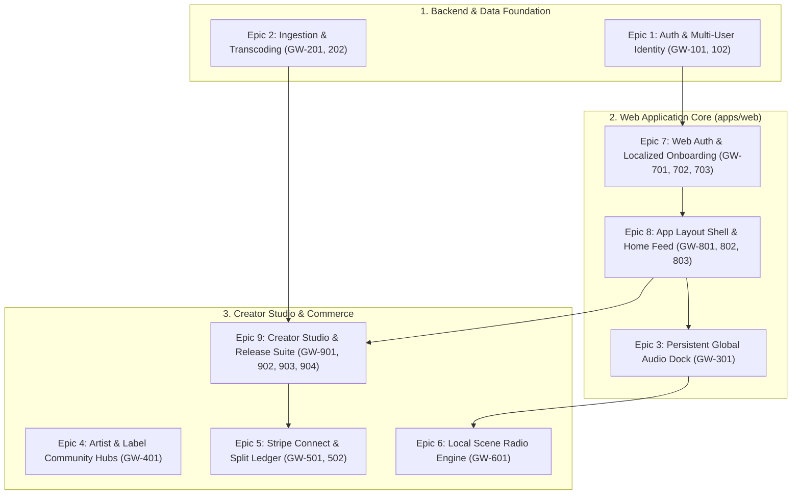

# Phase 1: Core Foundation & Alpha Breakdown
## Epic Breakdown, User Stories, and Technical Specifications

---

## 1. Phase 1 Overview & Architecture Relationship

* **Target Window**: Q4 2026 – Q1 2027
* **Primary Objective**: Build a production-grade local-first music platform where artists and labels upload lossless music, stream without dropouts, manage dedicated community hubs with strict moderation, and transact physical/digital sales and subscriptions with automated multi-party splits.

---

## 2. Epics & Technical Specifications

---

### Epic 1: Auth, Multi-User Identity & Geographic Scaffolding (Backend)
> **Goal**: Establish PostgreSQL schema, JWT authentication, and H3 spatial resolution indexing.
* **`[GW-101]`**: PostgreSQL 16 + PostGIS + pgvector DDL schema setup and migrations.
* **`[GW-102]`**: User identity, JWT authentication, and Creator Entity RBAC middleware.

---

### Epic 2: Audio/Video Ingestion & Lossless Transcoding Pipeline (Backend & Worker)
> **Goal**: Ingest master audio files direct-to-storage and asynchronously transcode multi-bitrate HLS and waveforms.
* **`[GW-201]`**: Presigned direct-to-storage master audio (WAV/FLAC) & artwork upload service.
* **`[GW-202]`**: FFmpeg asynchronous worker pipeline (HLS 128k/320k/Lossless FLAC + 100-point waveform extraction).

---

### Epic 3: Persistent Playback Engine & Global Audio Dock (`@groundwave/audio-core`)
> **Goal**: Uninterrupted, persistent audio playback state machine supporting 24-bit lossless streaming and waveform scrubbing.
* **`[GW-301]`**: Persistent global audio player dock, queue management, and waveform scrubber.

---

### Epic 4: Artist & Independent Label Community Hubs (Green Room)
> **Goal**: Creator-governed community spaces with strict anti-spam posting isolation and Street Team moderation.
* **`[GW-401]`**: Green Room post engine restricted to top-level photo and video posts, threaded comments, and reaction support.
* **`[GW-402]`**: Street Team Captain moderation console and broadcast updates.

---

### Epic 5: Financial Infrastructure & Stripe Connect Multi-Party Splits
> **Goal**: Monetization engine with direct merch sales, subscriptions, and automated instant band/label member splits.
* **`[GW-501]`**: Stripe Connect Custom/Express onboarding and direct purchases.
* **`[GW-502]`**: Tiered fan subscriptions and automated instant royalty splits (`royalty_split_pct`).

---

### Epic 6: Local Scene Radio & Geographic Discovery Engine
> **Goal**: High-performance spatial recommendation engine generating continuous local and regional radio streams.
* **`[GW-601]`**: Scene Radio hybrid queue generator (`pgvector` cosine similarity + PostGIS `ST_DWithin` + Redis weighted shuffle).
* **`[GW-602]`**: Scene Radio Genre & Micro-genre filtering engine.

---

### Epic 7: Web Authentication, Onboarding & User Account Management (`apps/web`)
> **Goal**: Deliver a frictionless web authentication, localized city onboarding, and profile management experience.

#### User Stories
* **US-7.1 (Web Auth Modal)**: As a user, I want a clean modal to log in or register via passwordless email or OAuth with instant token session initialization.
* **US-7.2 (City & Scene Picker)**: As a new user, I want to select my home city/neighborhood from a pre-calculated list of known cities so GroundWave calculates my H3 Res 8 cell for local scene discovery.
* **US-7.3 (Account Settings & Entity Switcher)**: As a creator with a band or record label, I want to switch between my personal fan profile and managed Creator Entities.
* **US-7.4 (Invite-Only Entry)**: As a prospective user, I need an invitation code to register during the initial alpha phase.

#### Tickets
* **`[GW-701]`**: Web Auth Modal & JWT Session Context (`Next.js 15 + React Query + Bearer Token Context`).
* **`[GW-702]`**: Localized Onboarding Wizard, pre-calculated known cities restriction, & H3 Scene Radius Selector.
* **`[GW-703]`**: User Account Settings & Creator Entity Context Switcher.
* **`[GW-704]`**: Invite-Only Signup Gateway & Invitation Code System.

---

### Epic 8: App Layout Shell, Hyperlocal Home Feed & Scene Radar UI (`apps/web`)
> **Goal**: Build the responsive webapp layout shell, hyperlocal feed aggregator, and public artist hub screens.

#### User Stories
* **US-8.1 (Responsive Shell)**: As a user, I want a persistent dark-mode layout with sidebar navigation, search bar, active city scene dropdown, and fixed bottom dock reservation.
* **US-8.2 (Hyperlocal Feed)**: As a listener, I want my home page to display local releases, photo/video posts (broadcasts) from local artists' hubs, and upcoming venue concerts in my city radius.
* **US-8.3 (Public Creator Hub)**: As a fan, I want to view an artist or label's discography, band roster, and merch store.

#### Tickets
* **`[GW-801]`**: Global App Shell & Persistent Navigation Layout (Sidebar, search header, city scene badge).
* **`[GW-802]`**: Hyperlocal Home Feed Aggregator UI (Local artist photo/video broadcasts, local releases carousel, venue concert radar).
* **`[GW-803]`**: Public Creator Hub & Storefront Profile Screen.

---

### Epic 9: Creator Studio & Release Management Suite (`apps/web`)
> **Goal**: Launch the dedicated Creator Studio dashboard (`/studio`) for artists and labels to publish music, manage inventory, and configure band splits.

#### User Stories
* **US-9.1 (Multi-Track Release Publisher)**: As an artist or label, I want a multi-step release creation wizard where I can enter metadata, drag-and-drop master WAV files with progress bars, upload cover art, and publish.
* **US-9.2 (Physical Merch Manager)**: As a creator, I want to configure vinyl/cassette inventory, pricing, and digital stem packs.
* **US-9.3 (Visual Band Splitter)**: As a band founder, I want to invite band members by `@username` and visually configure percentage royalty splits.

#### Tickets
* **`[GW-901]`**: Creator Studio Shell & Active Entity Dashboard (`/studio`).
* **`[GW-902]`**: Multi-Track Release & Audio Ingestion Wizard (Chunked direct-to-storage upload).
* **`[GW-903]`**: Storefront & Physical Merch Inventory Manager.
* **`[GW-904]`**: Team Memberships, Roles & Visual Royalty Split Manager.

---

### Epic 10: Personal Library & Fan Profile Pages (`apps/web`)
> **Goal**: Provide fans with dedicated spaces to showcase their musical identity, purchased media, and engagement statistics.

#### User Stories
* **US-10.1 (Personal Library)**: As a user, I want a library page to access my purchased tracks, digital stem packs, and saved playlists.
* **US-10.2 (Fan Profile Pages)**: As a fan, I want a public profile screen to show off my music collection, top artists, and continuous listening stats (similar to a continuous Spotify Wrapped).

#### Tickets
* **`[GW-1001]`**: Personal Library UI & Media Collection Access.
* **`[GW-1002]`**: Public Fan Profile Screen & Continuous Listening Stats Aggregation.
