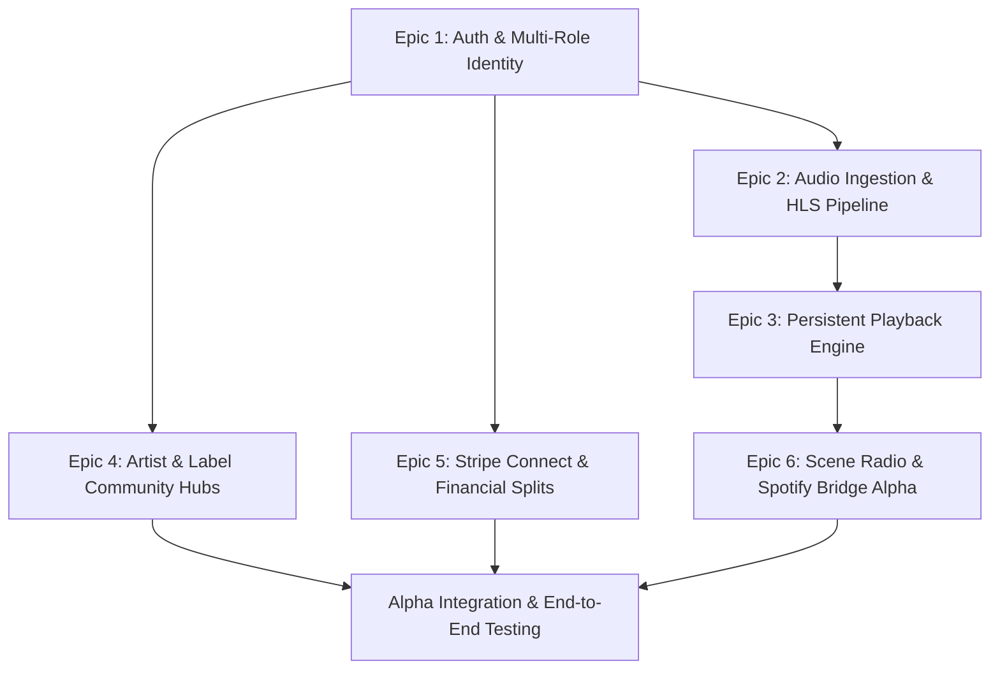

# Phase 1: Core Foundation & Alpha Breakdown
## Epic Breakdown, User Stories, and Technical Specifications

---

## 1. Phase 1 Overview & Milestone Gate

* **Target Window**: Q4 2026 – Q1 2027
* **Primary Objective**: Build a rock-solid, production-grade alpha platform that allows 10–20 seed artists and 2 indie labels to upload lossless music, stream without dropouts, host dedicated community hubs with strict moderation, and transact physical/digital sales and subscriptions with automated multi-party financial splits.
* **Alpha Milestone Gate**:
  * 10 seed artists and 2 indie labels successfully onboarded.
  * 50+ tracks transcoded to lossless FLAC and adaptive HLS with $< 250\text{ms}$ playback start latency.
  * Stripe Connect successfully routing multi-party splits (artist, label, platform).
  * 100 alpha listeners streaming continuous audio with persistent dock playback across navigation.

---

## 2. Epics & Technical Specifications

---

### Epic 1: Auth, Multi-Role Identity & Geographic Scaffolding

> **Goal**: Establish secure authentication, multi-role permission systems, and privacy-preserving geographic indexing.

#### 1.1 User Stories
* **US-1.1 (Listener)**: As a music fan, I want to sign up via Apple, Google, or Email so I can create an identity, set my home city/region, and customize my profile.
* **US-1.2 (Artist / Label)**: As an artist or record label owner, I want to register a verified creator profile with custom bio, social links, banner art, and designated headquarters location.
* **US-1.3 (Privacy)**: As a user, I want my geographic location to be obfuscated so that only my broad city/neighborhood is indexed, not my exact GPS coordinates.

#### 1.2 Technical Deliverables & Tasks
1. **JWT & OAuth Auth Service**:
   * Implement OAuth providers (Google, Apple) + Magic Link email auth.
   * Role-based access control (RBAC): `listener`, `artist`, `label`, `curator`, `venue`, `admin`.
2. **Geographic H3 Indexing Middleware**:
   * Integrate Uber's H3 spatial index library.
   * Calculate H3 Resolution 8 (~460m–1km) index on user registration and obfuscate raw latitude/longitude before DB persistence.
3. **Database Migrations**:
   * Implement `users`, `artist_profiles`, and `label_profiles` PostgreSQL tables with PostGIS extensions.

---

### Epic 2: Audio/Video Ingestion & Lossless Transcoding Pipeline

> **Goal**: Build a scalable asynchronous worker pipeline that ingests master audio files, verifies copyright integrity, and generates multi-bitrate HLS and lossless streams.

#### 2.1 User Stories
* **US-2.1 (Artist Upload)**: As an artist or label manager, I want to drag and drop master audio files (WAV, FLAC, AIFF) along with high-res cover art so they can be processed and published.
* **US-2.2 (Stem Packs)**: As a producer or artist, I want to upload optional stem packs (zipped drums, bass, vocals, synths) attached to my release.
* **US-2.3 (Copyright Check)**: As a rights holder, I want all uploaded audio to be automatically fingerprinted to prevent unauthorized re-uploads of copyrighted works.

#### 2.2 Technical Deliverables & Tasks
1. **Direct-to-S3/GCS Encrypted Chunked Ingestion**:
   * Presigned URL upload service for large master files (up to 2GB) with resumable uploads.
2. **FFmpeg Transcoding Worker (Temporal / Cloud Run)**:
   * Generate Master HLS playlist (`.m3u8`) with multi-tier audio streams:
     * `audio_low.m3u8` (AAC 128 kbps — mobile data saver)
     * `audio_high.m3u8` (AAC 320 kbps — high quality)
     * `audio_lossless.m3u8` (ALAC / FLAC 24-bit/48kHz — audiophile tier)
   * Extract normalized 100-point waveform JSON arrays for UI rendering.
3. **Acoustic Fingerprint Microservice**:
   * Integrate ACRCloud / Audible Magic API to verify audio fingerprint before publishing.

---

### Epic 3: Persistent Playback Engine & Core UI Client

> **Goal**: Develop a high-performance, gapless audio player state machine that persists uninterrupted across all client routing and background system states.

#### 3.1 User Stories
* **US-3.1 (Uninterrupted Playback)**: As a listener, I want music to continue playing without skipping or pausing while I browse different artist hubs, checkout merch, or read community posts.
* **US-3.2 (Lock Screen & Controls)**: As a commuter, I want lock-screen audio controls (Play/Pause, Skip, Scrubber) with album artwork and city origin tags displayed on my phone.
* **US-3.3 (Waveform Scrubbing)**: As an enthusiast, I want an interactive waveform scrubber to jump to specific sections of a track.

#### 3.2 Technical Deliverables & Tasks
1. **Client Audio State Machine (Zustand / Redux + Native Bridges)**:
   * Build persistent Global Audio Dock with background queue management, shuffle, repeat, and lookahead pre-buffering.
2. **Native Mobile Audio Session Bridges**:
   * iOS `AVAudioSession` / `MPNowPlayingInfoCenter` integration.
   * Android `MediaSessionCompat` / `ExoPlayer` service for background audio and Bluetooth/CarPlay integration.
3. **Adaptive Bitrate Streaming Client**:
   * Seamless switching between 128k, 320k, and Lossless FLAC depending on network latency.

---

### Epic 4: Artist & Independent Label Community Hubs

> **Goal**: Launch the dedicated community spaces for artists and labels with strict anti-spam posting isolation and granular moderation controls.

#### 4.1 User Stories
* **US-4.1 (Creator Broadcast)**: As an artist or label, I want to post updates, tour announcements, behind-the-scenes video clips, and exclusive audio drops directly to my hub.
* **US-4.2 (Anti-Noise Fan Posting)**: As an artist, I want fans to be able to post concert photos and discussion inside my hub, while preventing fan spam from polluting the platform's public feeds.
* **US-4.3 (Street Team Moderation)**: As an artist, I want to designate trusted superfans as "Street Team Captains" with permissions to pin posts, delete spam, and manage community queues.
* **US-4.4 (Label Roster Hub)**: As an indie label owner, I want a unified hub that automatically aggregates releases, tour dates, and updates from all my signed roster artists.

#### 4.2 Technical Deliverables & Tasks
1. **Community Post Engine & Database Schemas**:
   * Implement `community_posts` with role-based visibility (`public`, `subscribers_only`, `street_team`).
   * REST/GraphQL endpoints for feed creation, threaded replies, and image/video attachments.
2. **Moderation & Permission Service**:
   * Role management API: `hub_owner`, `hub_moderator`, `street_team_captain`.
   * Automated keyword blocklist filter and moderation queue for flagged content.
3. **Label-to-Artist Roster Mapping**:
   * Implement `label_roster_memberships` table with invitation/acceptance workflow.

---

### Epic 5: Financial Infrastructure & Stripe Connect Multi-Party Splits

> **Goal**: Implement the full direct-to-creator monetization engine, supporting subscriptions, storefronts, and automated contractual splits.

#### 5.1 User Stories
* **US-5.1 (Artist/Label Onboarding)**: As a creator, I want to link my bank account via Stripe Connect Express in under 3 minutes so I can receive payouts.
* **US-5.2 (Subscriptions / Backstage Clubs)**: As an artist or label, I want to create monthly/annual subscription tiers (\$5, \$15, \$30/mo) with custom perks and automated billing.
* **US-5.3 (Physical/Digital Merch Storefront)**: As a fan, I want to buy a limited vinyl pressing or digital album with Apple Pay in 2 taps.
* **US-5.4 (Automated Royalty Splits)**: As a label owner and band, I want revenue from our album sales to automatically split 50% to the label and 50% to the band's primary account at the moment of purchase.

#### 5.2 Technical Deliverables & Tasks
1. **Stripe Connect Integration**:
   * Stripe Connect Custom / Express onboarding flow with automated tax & 1099 compliance.
2. **Stripe Billing Subscriptions**:
   * Webhook handlers for subscription lifecycle: `customer.subscription.created`, `invoice.payment_succeeded`, `customer.subscription.deleted`.
3. **Product & Inventory Service**:
   * Implement `products` table with SKU inventory tracking, variants (sizes, colors, vinyl weights), and physical shipping address capture.
4. **Smart Split Settlement Ledger**:
   * Multi-destination Stripe Transfers executing instant programmatic splits (e.g., 92% to creator split pool, 8% platform fee).

---

### Epic 6: Scene Radio & Spotify Bridge Alpha

> **Goal**: Deliver the first version of the spatial recommendation engine and external library migration tool.

#### 6.1 User Stories
* **US-6.1 (Seed Station)**: As a casual listener, I want to tap "Start Radio" on an artist to get an infinite stream of musically and geographically related tracks.
* **US-6.2 (Spotify Library Import)**: As a new user, I want to connect my Spotify account to automatically import my top artists and generate my personalized local scene radio.

#### 6.2 Technical Deliverables & Tasks
1. **`pgvector` & Spatial Rec Engine**:
   * Seed-based candidate generator combining `ST_DWithin` PostGIS spatial filtering with cosine vector similarity on audio embeddings.
2. **Spotify OAuth & Catalog Matcher**:
   * OAuth integration with Spotify Web API (`user-library-read`, `user-top-read`).
   * Asynchronous batch matching of external ISRC codes and artist names against Groundwave catalog.

---

## 3. Phase 1 Sprint & Execution Schedule

```mermaid
gantt
    title Phase 1 Sprint Timeline (Weeks 1 - 16)
    dateFormat  X
    axisFormat  W%W

    section Sprint 1-4: Foundation
    Epic 1: Auth & Multi-Role Identity        :0, 4
    Epic 2: Ingestion & Transcoding Pipeline  :2, 6

    section Sprint 5-8: Playback & Hubs
    Epic 3: Persistent Playback Engine        :4, 8
    Epic 4: Artist & Label Community Hubs     :6, 10

    section Sprint 9-12: Monetization
    Epic 5: Stripe Connect & Financial Splits :8, 12
    Epic 6: Scene Radio & Spotify Bridge      :10, 14

    section Sprint 13-16: Alpha Testing
    End-to-End Alpha Integration Testing      :12, 16
    Seed Artist & Label Onboarding Pilot      :14, 16
```

---

## 4. Phase 1 Acceptance Criteria Checklist

- [ ] **Auth**: Users can sign up, select roles, and have their home city location indexed to H3 hex grid without exposing GPS coordinates.
- [ ] **Transcoding**: Master FLAC/WAV uploads process into HLS (128k, 320k, FLAC) within $< 90\text{seconds}$ for a 4-minute track.
- [ ] **Playback**: Global bottom player dock maintains seamless continuous playback across 100% of route changes and background lock screens.
- [ ] **Hubs**: Fans are prevented from posting to global broadcast feeds and can only post inside followed creator hubs.
- [ ] **Commerce**: Fans can subscribe to a \$5/mo tier and purchase a physical vinyl SKU; Stripe splits 92% directly to the creator/label account.
- [ ] **Scene Radio**: Seed radio returns a continuous queue of 20+ tracks with $< 200\text{ms}$ station generation latency.
